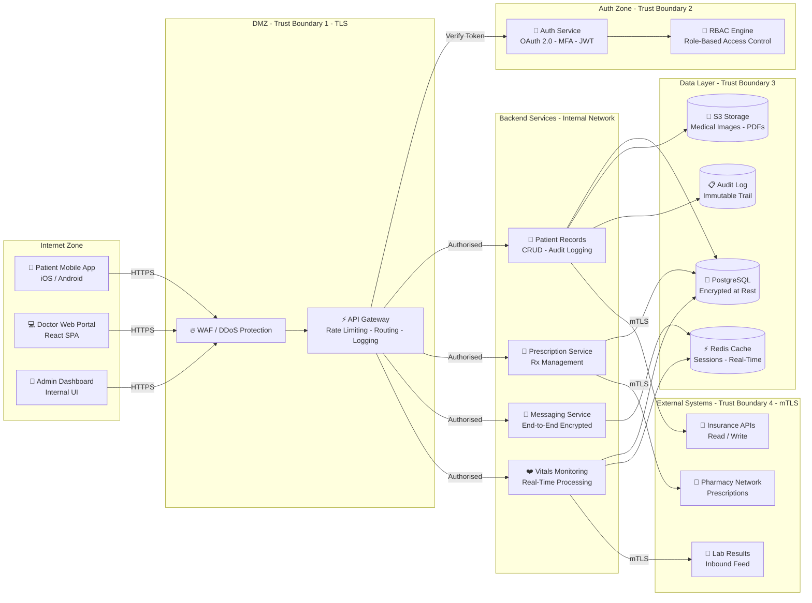

# Solaris Care Connect 360 Architecture

## Overview
This document describes the architecture of the Solaris Care Connect 360 healthcare platform.

## Components

### Frontend Applications
- **Patient Mobile App**: iOS/Android app for patients
- **Doctor Portal**: Web application for healthcare providers
- **Admin Dashboard**: Internal management interface

### Backend Services
- **API Gateway**: Central entry point, rate limiting, routing
- **Auth Service**: OAuth 2.0, MFA, session management
- **Patient Records**: CRUD for patient data, audit logging
- **Prescription Service**: Rx management, pharmacy integration
- **Messaging Service**: Doctor-patient secure messaging
- **Vitals Monitoring**: Real-time health data processing

### Data Stores
- **PostgreSQL**: Primary database (encrypted at rest)
- **S3**: Document storage (medical images, PDFs)
- **Redis**: Session cache, real-time data

### External Integrations
- Insurance provider APIs (read/write)
- Pharmacy network (prescriptions)
- Lab results feed (inbound)

## Trust Boundaries
1. Internet → API Gateway (TLS termination)
2. API Gateway → Backend Services (internal network)
3. Backend Services → Database (encrypted connection)
4. Backend Services → External APIs (mutual TLS)

