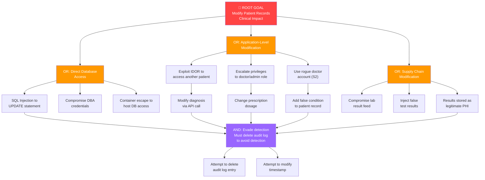
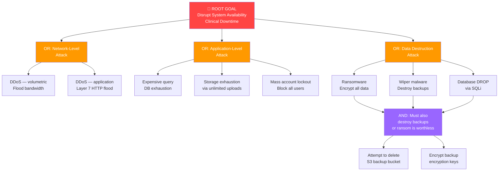
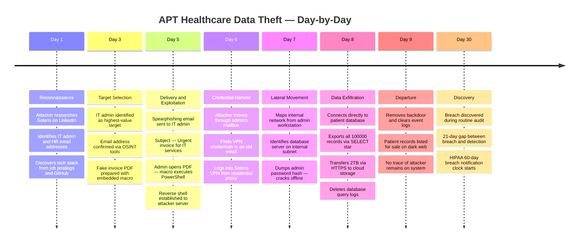

# Attack Trees — Solaris Care Connect 360

---

## What is an Attack Tree?

An attack tree is a diagram that maps **every possible path an attacker
could take to achieve a goal**. Rather than modelling one attack at a time
(as the Kill Chain does), an attack tree shows all routes simultaneously —
making it easier to identify which path is easiest, most likely, and most
dangerous.

Attack trees use three node types:

| Node | Symbol | Meaning |
|------|--------|---------|
| **Root** | Top node | The attacker's ultimate goal |
| **OR node** | Branching node | Any one child path is sufficient to succeed |
| **AND node** | Joined node | All child steps must succeed (harder to exploit) |
| **Leaf** | End node | An individual, concrete attack step |

The value of an attack tree is not just visualisation — it lets you
calculate which path has the **lowest cost and skill requirement for the
attacker**, so you know where to focus defensive investment.

---

## Attack Tree 1: Steal Patient PHI

> **Attacker goal:** Obtain patient health records (PHI) in usable form.
> This is the primary target in healthcare cyberattacks — PHI sells for
> £300–£500 per record on criminal marketplaces.

```mermaid
flowchart TD
    GOAL["🎯 ROOT GOAL
    Steal Patient PHI
    100,000 records"]

    GOAL --> EXT["OR: External Attack
    Attacker has no prior access"]
    GOAL --> INS["OR: Insider Attack
    Attacker has valid credentials"]
    GOAL --> SUP["OR: Supply Chain Attack
    Attacker compromises a vendor"]

    EXT --> SQLI["OR: SQL Injection
    Difficulty: Medium
    Skill: Low–Medium"]
    EXT --> PHISH["OR: Phishing
    Difficulty: Low
    Skill: Low"]
    EXT --> CRED["OR: Credential Stuffing
    Difficulty: Low
    Skill: Very Low"]

    SQLI --> S1["Find injectable
    API parameter"]
    SQLI --> S2["Inject UNION SELECT
    to dump table"]
    SQLI --> S3["Exfiltrate via
    HTTP response"]

    PHISH --> P1["Identify staff
    email addresses"]
    PHISH --> P2["Send spearphishing
    email with payload"]
    PHISH --> P3["Steal credentials
    or install malware"]
    PHISH --> P4["Log in with stolen
    credentials"]

    CRED --> C1["Purchase leaked
    credential database"]
    CRED --> C2["Run automated
    stuffing tool"]
    CRED --> C3["Identify valid
    accounts (2% success)"]
    CRED --> C4["Access patient
    portal"]

    INS["OR: Insider Attack"] --> I1["Abuse existing
    read access
    (Rogue doctor)"]
    INS --> I2["Escalate privileges
    to admin level"]

    I1 --> I1A["Query records
    outside assigned list"]
    I1 --> I1B["Bulk export via
    API or CSV"]

    I2 --> I2A["Exploit IDOR
    vulnerability"]
    I2 --> I2B["Perform SQLi from
    internal network"]

    SUP --> SP1["Compromise lab
    system vendor"]
    SUP --> SP2["Use vendor's valid
    API credentials"]
    SUP --> SP3["Access Solaris via
    trusted integration"]

    style GOAL fill:#ff4444,color:#fff
    style EXT fill:#ff9900,color:#fff
    style INS fill:#ff9900,color:#fff
    style SUP fill:#ff9900,color:#fff
    style SQLI fill:#ffcc00,color:#333
    style PHISH fill:#ffcc00,color:#333
    style CRED fill:#ffcc00,color:#333
```

---

## Attack Path Analysis — Tree 1

Each path is scored by three factors:
- **Skill Required:** How technically capable must the attacker be?
- **Steps to Goal:** Fewer steps = faster, lower chance of detection
- **Detection Risk (without controls):** How likely is detection if no controls exist?

| Path | Skill Required | Steps | Detection Risk | Verdict |
|------|---------------|:-----:|----------------|---------|
| Credential Stuffing | Very Low | 4 | Low | 🔴 Easiest path |
| Phishing | Low | 4 | Medium | 🟠 Second easiest |
| SQL Injection | Low–Medium | 3 | Low (no WAF) | 🔴 Highest impact |
| Insider — Read Abuse | Very Low | 2 | Low (no UBA) | 🔴 Hardest to detect |
| Insider — Privilege Escalation | Medium | 2 | Medium | 🟠 High risk |
| Supply Chain | High | 3 | Very Low | 🟠 Stealthy |

### Critical Finding

> **Credential stuffing is the easiest path with the lowest barrier to entry.**
> An attacker needs only to purchase a leaked password list (freely available
> online) and run an automated tool. Without universal MFA enforcement,
> this attack requires zero technical skill and completes in hours.
>
> **SQL injection has the highest impact** — a single successful injection on
> the patient records API could expose the entire database in one request.
> Without a WAF and parameterised queries, this is exploitable by any
> attacker with basic knowledge.

---

## Attack Tree 2: Modify Patient Records

> **Attacker goal:** Alter medical records — diagnoses, prescriptions, or
> vital signs — to cause patient harm, create liability, or extort the platform.
> This is the most clinically dangerous attack type in healthcare.

### Key Insight — The AND Node

The **AND node** (Evade Detection) reveals something important: to successfully
modify records without being caught, the attacker must *also* tamper with the
audit log. This means:

- Audit log tampering (T3) is not a standalone threat — it is a **dependency** of every data modification attack
- Making audit logs immutable and write-once **breaks the AND node**, meaning even a successful record modification is detected and attributable
- This is why immutable audit logs are a pre-launch requirement, not an optional improvement

---

## Attack Tree 3: Disrupt System Availability

> **Attacker goal:** Make Solaris Care Connect 360 unavailable to patients
> and clinicians. In healthcare, downtime directly impacts patient care —
> doctors cannot access records, prescriptions cannot be issued.

### Key Insight — Ransomware AND Node

Ransomware only succeeds if the attacker can **also destroy or encrypt the
backups**. This AND node is critical:

- If backups are immutable (S3 Object Lock), the attacker cannot destroy them
- This means ransomware becomes a temporary inconvenience rather than a
  catastrophic breach — restore from backup and continue
- This is why immutable backups (GAP-11) are marked as a pre-launch requirement
  in the risk register

---

## APT Attack Simulation: Healthcare Data Theft

> This simulation models a real attack pattern observed in healthcare breaches.
> It combines the attack tree paths above into a day-by-day timeline.

### Threat Actor Profile

| Attribute | Detail |
|-----------|--------|
| **Type** | Advanced Persistent Threat (APT) — financially motivated |
| **Goal** | Steal and sell 100,000 patient records |
| **Entry Vector** | Spearphishing targeting IT staff |
| **Time to Objective** | 9 days undetected (without controls) |
| **Real-World Parallel** | Change Healthcare (2024), Anthem (2015) |

### Attack Timeline

### Detection Points — Where Solaris Controls Intervene

| Day | Attack Step | Detection Method | Alert Threshold | Control Status |
|-----|------------|-----------------|----------------|----------------|
| Day 5 | Phishing email delivered | Email gateway + sandbox | Macro-enabled PDF from external sender | ✅ Implemented |
| Day 5 | Macro execution | EDR on endpoint | PowerShell spawned from Office process | ⚠️ Depends on EDR deployment |
| Day 6 | VPN login from new location | Geo-anomaly detection | Login from unrecognised country/IP | 🟡 Partial |
| Day 7 | Lateral movement to DB | Network anomaly | Admin workstation connecting to DB subnet | ❌ Not yet implemented |
| Day 7 | Password hash dump | SIEM rule | LSASS memory access from non-system process | ❌ Not yet implemented |
| Day 8 | Bulk data export | DLP alert | Query returns >10,000 records | ❌ Not yet implemented |
| Day 8 | Log deletion | Immutable audit log | Deletion attempt triggers alert | ✅ Implemented (write-once) |
| Day 8 | Outbound data transfer | Traffic anomaly | 2TB outbound HTTPS to unknown destination | 🟡 Partial |

### Impact Without Controls vs With Controls

| Scenario | Breach Size | Detection Time | Outcome |
|----------|:-----------:|:--------------:|---------|
| No controls | 100,000 records | 21 days | Full PHI breach — HIPAA fine — reputational collapse |
| Current state (partial) | ~10,000 records | 8–12 days | Significant breach — notification required |
| Target state (all controls) | 0 records | <1 hour | Attack chain broken at Day 5 (email sandbox) |

---

## Control Effectiveness by Attack Path

> Shows which controls break which attack paths, and where gaps remain.

| Attack Path | Key Control | Status | Effect |
|-------------|------------|--------|--------|
| SQL Injection | Parameterised queries | 🟡 Partial | Blocks most paths — raw queries remain |
| SQL Injection | WAF | ❌ Missing | Without WAF, attacker can enumerate freely |
| Phishing | MFA | 🟡 Partial | Stolen credentials useless if MFA enforced for all |
| Phishing | Email sandbox | ✅ Implemented | Malicious attachments detonated before delivery |
| Credential stuffing | MFA | 🟡 Partial | Admin-only — patient accounts still vulnerable |
| Credential stuffing | Rate limiting | ✅ Implemented | Slows automated tools significantly |
| Insider — read abuse | RBAC data scope | 🟡 Partial | Doctor can still query outside scope via IDOR |
| Insider — read abuse | UBA | ❌ Missing | No behavioural baseline — insider undetected |
| Insider — privilege escalation | Server-side RBAC | 🟡 Partial | Client-side checks only on some endpoints |
| Supply chain | mTLS + result signing | ✅ Implemented | Unsigned results rejected |
| Record modification | Immutable audit log | 🟡 Partial | Logs exist but not fully write-once yet |
| Record modification | Field integrity hashing | ❌ Missing | Tampering not detectable on record reads |
| Ransomware | Immutable backups | ❌ Missing | S3 Object Lock not yet configured |
| Ransomware | Email sandbox | ✅ Implemented | Primary delivery vector blocked |

---

## Summary: Easiest Attack Paths (Priority Order)

| Rank | Attack Path | Why It's the Easiest | Blocking Control |
|------|------------|----------------------|-----------------|
| 1 | **Credential stuffing** | Zero skill, automated, patient accounts have no MFA | Enforce MFA universally |
| 2 | **SQL injection (no WAF)** | One crafted request dumps entire database | Deploy WAF + fix raw queries |
| 3 | **Insider read abuse** | No skill needed, valid credentials, no UBA baseline | Deploy UBA + fix IDOR |
| 4 | **Phishing → credential theft** | Low skill, MFA only partial, IDOR still exploitable | Enforce MFA for all accounts |
| 5 | **Supply chain lab feed** | Hard but undetectable — blends with legitimate traffic | Vendor security assessment |

---

## Glossary

| Term | Definition |
|------|-----------|
| **Attack tree** | A diagram showing all paths an attacker could take to achieve a single goal |
| **Root node** | The attacker's ultimate objective at the top of the tree |
| **OR node** | Any one branch succeeding is sufficient for the attacker to proceed |
| **AND node** | All branches must succeed — harder to exploit, easier to defend |
| **Leaf node** | A single, concrete, individual attack step |
| **APT** | Advanced Persistent Threat — a sophisticated, patient attacker (often nation-state or organised crime) |
| **OSINT** | Open Source Intelligence — researching a target using only public information |
| **UBA** | User Behaviour Analytics — software that baselines normal activity and alerts on deviations |
| **IDOR** | Insecure Direct Object Reference — accessing another user's data by guessing their ID |
