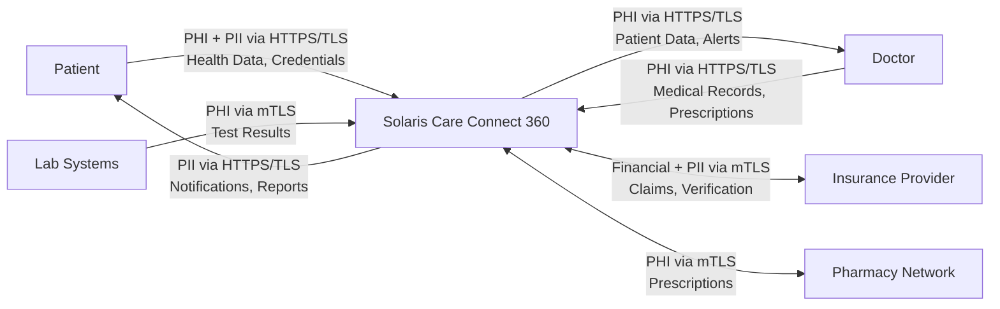

# Level 0 Data Flow Diagram

> ⚠️ Any flow containing PHI must be encrypted and logged!

## External Entities
- **Patients**: End users accessing health data
- **Doctors**: Healthcare providers
- **Insurance**: Claims processing and verification
- **Pharmacies**: Prescription fulfillment
- **Labs**: Test result delivery

## Sensitive Data Flows

**PHI (Protected Health Information) — HIPAA Regulated:**
- Patient records queries
- Lab results inbound
- Prescription data

**PII (Personally Identifiable Information):**
- Login credentials
- Patient demographics
- Insurance information

**Financial Data:**
- Insurance claims
- Payment information

## Data Classification

| Data Type | Classification | Encryption Required | Logging Required |
|---|---|---|---|
| Patient Records | PHI - Critical | Yes (AES-256) | Yes - Full |
| Login Credentials | PII - High | Yes (bcrypt) | Yes - Access |
| Session Tokens | Sensitive | Yes (JWT signed) | Yes - Access |
| Audit Logs | Internal | Yes (at rest) | N/A |
| Insurance Claims | Financial - High | Yes (mTLS) | Yes - Full |
| Prescription Data | PHI - Critical | Yes (AES-256) | Yes - Full |
| Lab Results | PHI - Critical | Yes (AES-256) | Yes - Full |

