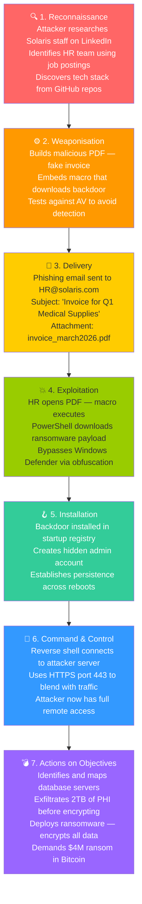

# Kill Chain Analysis — Solaris Care Connect 360

---

## What is the Cyber Kill Chain?

The **Cyber Kill Chain** is a framework developed by Lockheed Martin that
models a cyberattack as a sequence of 7 stages. The core principle is:

> **An attacker must complete every stage in order to succeed.
> If you break the chain at ANY stage — the attack fails.**

This is why it's called a "kill chain" — your goal is to *kill* the attack
by breaking the chain as early as possible.

### The 7 Stages

```
1. Reconnaissance  →  2. Weaponisation  →  3. Delivery  →  4. Exploitation
→  5. Installation  →  6. Command & Control  →  7. Actions on Objectives
```

| Stage | What the attacker does | Defender goal |
|-------|----------------------|---------------|
| **1. Reconnaissance** | Research the target — LinkedIn, job postings, tech stack | Make yourself hard to research |
| **2. Weaponisation** | Build the attack tool — malicious PDF, exploit code | No visibility here; focus on next stages |
| **3. Delivery** | Send the weapon — phishing email, USB, web exploit | Block delivery before it reaches the target |
| **4. Exploitation** | Trigger the weapon — macro runs, vulnerability exploited | Patch systems, block execution |
| **5. Installation** | Establish foothold — backdoor, persistence mechanism | Detect unusual file/process creation |
| **6. Command & Control (C2)** | Attacker connects back to take control | Monitor outbound traffic, block C2 channels |
| **7. Actions on Objectives** | Do the actual damage — steal data, encrypt, destroy | Detect data movement, contain blast radius |

### Left of Boom vs Right of Boom

A key concept used by real security teams:

- **Left of Boom** (Stages 1–3): *Prevention* — stop the attack before it lands
- **Right of Boom** (Stages 4–7): *Detection & Response* — contain and eject the attacker

> 💡 **The earlier you break the chain, the lower the cost.**
> Breaking it at Stage 3 (Delivery) costs almost nothing.
> Breaking it at Stage 7 (Actions) after a breach costs millions.

---

## Scenario 1: Ransomware Attack

> **Threat actor goal:** Encrypt patient database and demand ransom payment.
> **Entry point:** HR department targeted via spearphishing.
> **Real-world parallel:** Change Healthcare ransomware attack (2024) — cost $22B.



### Detection Opportunities

| Stage | What to look for | Detection Tool | Priority |
|-------|-----------------|----------------|----------|
| Reconnaissance | Unusual traffic to company LinkedIn, public GitHub | OSINT monitoring, web analytics | 🟡 Low |
| Weaponisation | No visibility — attacker-side only | N/A | ⬛ None |
| Delivery | Suspicious email attachment, failed DMARC | Email gateway, sandbox detonation | 🔴 Critical |
| Exploitation | Macro execution, PowerShell spawned from Office | EDR, application allowlisting | 🔴 Critical |
| Installation | New files in startup locations, hidden account created | FIM, HIDS, SIEM rules | 🟠 High |
| C2 | Outbound HTTPS to unknown IP, beaconing pattern | NDR, DNS filtering, firewall logs | 🟠 High |
| Actions | Bulk file encryption, large outbound data transfer | DAM, DLP, backup monitoring | 🔴 Critical |

### Breaking the Chain — Solaris Controls

| Stage | Control in Place | Status |
|-------|-----------------|--------|
| Delivery | SPF/DKIM/DMARC + email sandbox | ✅ Implemented |
| Exploitation | Macro blocking, EDR on all endpoints | ✅ Implemented |
| Installation | File integrity monitoring (FIM), SIEM rules for new accounts | ✅ Implemented |
| C2 | Outbound firewall whitelist, DNS anomaly detection | ✅ Implemented |
| Actions | Immutable encrypted backups — ransomware cannot destroy them | 🟡 Partial — S3 Object Lock not yet configured (GAP-11) |
| Actions | DLP alerts on bulk data transfer before encryption | 🟡 Partial — no threshold configured yet (see I2 gap register) |

> ⚠️ **Verdict:** The chain is partially broken. Email sandbox and EDR stop
> most delivery and exploitation attempts. However, immutable backups (GAP-11)
> and DLP thresholds are not yet fully in place — ransomware that reaches the
> Actions stage could still succeed until these gaps are closed.

---

## Scenario 2: Insider Threat — Rogue Doctor

> **Threat actor goal:** Steal patient PHI to sell to a competitor or broker.
> **Entry point:** Legitimate doctor account — no break-in required.
> **Real-world parallel:** Anthem insider breach (2015) — 18,000 patient records stolen by employee.

```mermaid
flowchart TD
    style R2 fill:#ff6666,color:#fff
    style W2 fill:#ff9900,color:#fff
    style De2 fill:#ffcc00,color:#333
    style Ex2 fill:#99cc00,color:#333
    style In2 fill:#33cc99,color:#fff
    style C2s fill:#3399ff,color:#fff
    style A2 fill:#9966ff,color:#fff

    R2["🔍 1. Reconnaissance
    Doctor already knows the system layout
    Knows which patients have high-value data
    Identifies gaps in audit coverage"] 
    --> W2["⚙️ 2. Weaponisation
    Uses own valid credentials — no exploit needed
    Plans timing: after-hours, quiet period
    Identifies which API endpoints return bulk data"]
    --> De2["📥 3. Delivery
    N/A — already inside the system
    Uses standard login from work laptop
    No phishing, no malware required"]
    --> Ex2["🔓 4. Exploitation
    Abuses own legitimate doctor privileges
    Queries patient records outside assigned list
    Uses IDOR vulnerability to access other patients"]
    --> In2["🪝 5. Installation
    Creates secondary backup account for future access
    Schedules automated exports to personal cloud
    Disables personal device audit logging"]
    --> C2s["📡 6. Command & Control
    Uses legitimate tools (browser, API, export function)
    Blends with normal activity — hard to distinguish
    Exports data via standard HTTPS — no suspicious traffic"]
    --> A2["💣 7. Actions on Objectives
    Exports 50,000 patient records to personal Dropbox
    Sells PHI for £150 per record on dark web
    Denies all knowledge (Repudiation threat R1)"]
```



### Why Insider Threats Are Hardest to Detect

Insider threats are uniquely difficult because:
- The attacker has **valid credentials** — no alarm triggers on login
- They use **legitimate tools** — no malware to detect
- They know **where the gaps are** in monitoring
- They **blend with normal behaviour** — hard to distinguish from real work

### Detection Opportunities

| Stage | What to look for | Detection Tool | Priority |
|-------|-----------------|----------------|----------|
| Reconnaissance | Doctor accesses records outside their assigned patients | UBA, SIEM rules | 🟠 High |
| Weaponisation | Unusual API calls testing data return volumes | API monitoring | 🟡 Medium |
| Delivery | Login outside normal hours, VPN from unusual location | SIEM, geo-anomaly detection | 🟠 High |
| Exploitation | IDOR — patient IDs accessed sequentially (1,2,3,4…) | API anomaly detection | 🔴 Critical |
| Installation | New account created, export task scheduled | SIEM, account monitoring | 🔴 Critical |
| C2 | Large HTTPS upload to personal cloud (Dropbox, Drive) | DLP, proxy inspection | 🔴 Critical |
| Actions | Bulk records export, data leaving to personal device | DLP, DAM | 🔴 Critical |

### Insider-Specific Controls at Solaris

| Control | What it does | Status |
|---------|-------------|--------|
| **RBAC with data scope** | Doctor can only access their assigned patients' records | 🟡 Partial — not enforced server-side consistently (see E1) |
| **IDOR prevention** | Server-side check: does this doctor own this patient ID? | 🟡 Partial — some endpoints rely on client-supplied role |
| **Immutable audit logs** | Every access logged with user, timestamp, resource | 🟡 Partial — audit DB is not fully write-once yet (see T1) |
| **DLP on exports** | Alert if >100 records downloaded in single session | 🟡 Partial — no threshold configured yet (see I2) |
| **User Behaviour Analytics (UBA)** | Baseline normal behaviour, alert on deviations | 🟡 Planned |
| **Privileged Access Management (PAM)** | Extra controls and logging on high-privilege accounts | 🟡 Planned |
| **Regular access reviews** | Quarterly check: does this doctor still need this access? | 🟡 Planned |

> ⚠️ **Verdict:** The chain is partially broken. RBAC partially limits access
> but is not consistently enforced server-side. Audit logs exist but are not
> yet write-once. DLP thresholds are not yet configured. UBA and PAM remain
> planned. A careful insider can still operate below detection thresholds
> until these gaps are remediated.

---

## Scenario 3: External Attacker via SQL Injection

> **Threat actor goal:** Steal entire patient database via a vulnerable API endpoint.
> **Entry point:** Patient-facing records API — publicly accessible.
> **Real-world parallel:** Advocate Medical Group SQL injection breach (2013) — 4M records stolen.


### Detection Opportunities

| Stage | What to look for | Detection Tool | Priority |
|-------|-----------------|----------------|----------|
| Reconnaissance | Port scanning, API fuzzing from same IP | WAF, IDS | 🟡 Medium |
| Delivery | SQL keywords in API parameters (UNION, SELECT, DROP) | WAF, SIEM | 🔴 Critical |
| Exploitation | DB error messages returned to client, unusual query times | SIEM, DAM | 🔴 Critical |
| Installation | New stored procedures, web shell created on disk | FIM, DAM | 🔴 Critical |
| C2 | Unusual outbound connections from DB server | NDR, firewall | 🔴 Critical |
| Actions | Bulk data leaving DB, audit log deletion attempts | DAM, DLP | 🔴 Critical |

### Breaking the Chain — Solaris Controls

| Stage | Control in Place | Status |
|-------|-----------------|--------|
| Delivery | WAF with SQL injection rules | ❌ Missing — not yet deployed (GAP-1) |
| Exploitation | Parameterised queries / ORM | 🟡 Partial — ORM in use but some raw queries remain (GAP-1 dependency) |
| Exploitation | Verbose errors disabled — no SQL errors returned to client | ❌ Missing — SQL errors still returned to client (GAP-2) |
| Installation | DB user is SELECT-only — cannot create stored procedures | ❌ Missing — app DB user has DBA-level access (GAP-4) |
| C2 | DB server in private VPC — no outbound internet | ✅ Implemented |
| Actions | Audit logs write-once — deletion is impossible | 🟡 Partial — audit DB not fully write-once yet (see T1) |

> ⚠️ **Verdict:** This chain is **not yet broken**. The WAF is missing (GAP-1),
> raw SQL queries remain exploitable, verbose error messages confirm injection
> success to the attacker (GAP-2), and the app DB user holds DBA-level
> privileges (GAP-4) enabling full database control and stored procedure
> creation. All four of these are pre-launch Critical requirements.
> Defense-in-depth cannot compensate while the foundational preventive
> controls are absent.

---

## Scenario 4: Supply Chain Attack via Compromised Lab System

> **Threat actor goal:** Inject false lab results to cause patient harm and
> create medical liability for Solaris.
> **Entry point:** Third-party lab integration feed.
> **Real-world parallel:** SolarWinds supply chain attack methodology (2020) — adapted to healthcare lab feeds.

```mermaid
flowchart TD
    style R4 fill:#ff6666,color:#fff
    style W4 fill:#ff9900,color:#fff
    style De4 fill:#ffcc00,color:#333
    style Ex4 fill:#99cc00,color:#333
    style In4 fill:#33cc99,color:#fff
    style C4 fill:#3399ff,color:#fff
    style A4 fill:#9966ff,color:#fff

    R4["🔍 1. Reconnaissance
    Attacker identifies lab vendor used by Solaris
    Targets lab vendor — smaller, weaker security
    Studies HL7/FHIR data format used for results"] 
    --> W4["⚙️ 2. Weaponisation
    Compromises lab vendor's result dispatch system
    Builds fake result payloads in valid HL7 format
    Fake results indistinguishable from legitimate ones"]
    --> De4["📨 3. Delivery
    Fake lab results sent via legitimate lab API connection
    Uses valid lab system credentials (already compromised)
    Results arrive over mTLS — appears trusted"]
    --> Ex4["⚗️ 4. Exploitation
    Solaris ingests fake results as legitimate
    Malignant patient shown as cancer-free
    Diabetic patient's glucose shown as normal"]
    --> In4["🪝 5. Installation
    Attacker maintains persistent access to lab system
    Can inject results on demand for specific patients
    Original legitimate results overwritten"]
    --> C4["📡 6. Command & Control
    Uses lab vendor's own infrastructure as C2
    All traffic looks like normal lab result delivery
    Virtually impossible to detect from network traffic alone"]
    --> A4["💣 7. Actions on Objectives
    Patients receive wrong diagnoses
    Doctors prescribe incorrect treatments
    Solaris faces massive liability and MHRA investigation
    Attacker may demand ransom to stop or reveal which results were fake"]
```



### Breaking the Chain — Solaris Controls

| Stage | Control in Place | Status |
|-------|-----------------|--------|
| Delivery | mTLS with certificate pinning — only our specific lab cert is trusted | ✅ Implemented |
| Delivery | Cryptographic signing — all results must be signed by lab's private key | ✅ Implemented |
| Exploitation | Anomaly detection — results outside statistically normal ranges flagged | ✅ Implemented |
| Installation | Pharmacist confirmation required before acting on critical results | ✅ Implemented |
| Actions | Dual-doctor verification required for life-critical diagnoses | 🟡 Planned |
| Actions | Vendor security assessment — labs must meet minimum security standard | 🟡 Planned |

> ⚠️ **Verdict:** Chain is partially broken. mTLS and result signing stop
> most injection attempts. The planned vendor security assessment is critical
> — if the lab vendor is compromised, our controls only go so far.
> **Third-party risk management is the key gap here.**

---

## Scenario 5: Account Takeover via Credential Stuffing

> **Threat actor goal:** Access patient accounts at scale using credentials
> leaked from other breaches.
> **Entry point:** Patient-facing login portal.
> **Real-world parallel:** Used against NHS login portals and US healthcare patient portals routinely.

```mermaid
flowchart TD
    style R5 fill:#ff6666,color:#fff
    style W5 fill:#ff9900,color:#fff
    style De5 fill:#ffcc00,color:#333
    style Ex5 fill:#99cc00,color:#333
    style In5 fill:#33cc99,color:#fff
    style C5 fill:#3399ff,color:#fff
    style A5 fill:#9966ff,color:#fff

    R5["🔍 1. Reconnaissance
    Purchases 50M leaked email + password combos
    From previous breaches: LinkedIn, Adobe, RockYou2024
    Filters list for likely healthcare email addresses"] 
    --> W5["⚙️ 2. Weaponisation
    Sets up automated credential stuffing tool (Sentry MBA)
    Configures proxies to rotate IP addresses
    Prepares for high-volume login attempts"]
    --> De5["🤖 3. Delivery
    Sends 50,000 login attempts to Solaris login endpoint
    Rotates through 10,000 different IP addresses
    Uses realistic browser headers to bypass basic detection"]
    --> Ex5["🔓 4. Exploitation
    2% success rate = 1,000 valid accounts compromised
    Patients reuse passwords from other breached sites
    MFA not enforced for all users — single credential sufficient"]
    --> In5["🪝 5. Installation
    Changes account recovery email on compromised accounts
    Locks out legitimate patients
    Sets up persistent access for future use"]
    --> C5["📡 6. Command & Control
    Logs in from residential proxy IPs — looks legitimate
    Accesses accounts gradually to avoid detection
    Sells account access on dark web forums"]
    --> A5["💣 7. Actions on Objectives
    Downloads all PHI for 1,000 patients
    Accesses prescription history, diagnoses, SSNs
    Sells medical identity data — worth £500+ per record"]
```



### Breaking the Chain — Solaris Controls

| Stage | Control in Place | Status |
|-------|-----------------|--------|
| Delivery | Rate limiting — max 5 login attempts per IP per minute | ✅ Implemented |
| Delivery | CAPTCHA after 3 failed attempts | ✅ Implemented |
| Exploitation | MFA required for all patient accounts | 🟡 Partial — MFA enforced for admin accounts only, not all users (GAP-5) |
| Exploitation | Breach password detection — check against HaveIBeenPwned database | 🟡 Planned (GAP-7) |
| Installation | Email alert to patient on any account change | ✅ Implemented |
| Actions | Geo-anomaly detection — alert if login from unusual country | 🟡 Planned |
| Actions | Session binding — session tied to device fingerprint | 🟡 Planned |

> ⚠️ **Verdict:** The chain is **partially broken**. Rate limiting and CAPTCHA
> slow automated tools significantly. However, MFA is not yet enforced for all
> patient accounts (GAP-5) — stolen credentials remain sufficient to access
> non-admin patient accounts. Universal MFA enforcement is a pre-launch
> Critical requirement and must be in place before go-live.

---

## Kill Chain Summary — Solaris Coverage

| Scenario | Chain Broken At | Verdict |
|----------|----------------|---------|
| Ransomware | Stage 3 (Delivery) — email sandbox | ⚠️ Partially broken — immutable backups and DLP incomplete |
| Insider Threat | Stage 4 (Exploitation) — RBAC + IDOR prevention | ⚠️ Partially broken — RBAC/IDOR partial, DLP/UBA missing |
| SQL Injection | Stage 4 (Exploitation) — parameterised queries | ⚠️ Partially broken — WAF missing, raw queries remain, DBA access (GAP-1/2/4) |
| Supply Chain | Stage 3 (Delivery) — mTLS + result signing | ⚠️ Mostly broken — vendor assessment pending |
| Credential Stuffing | Stage 4 (Exploitation) — MFA | ⚠️ Partially broken — MFA admin-only, patient accounts exposed (GAP-5) |

### Priority Gaps to Close

1. 🔴 **WAF deployment** — SQL injection chain currently unbroken without it (GAP-1)
2. 🔴 **Universal MFA enforcement** — credential stuffing chain currently unbroken for patient accounts (GAP-5)
3. 🔴 **DB least privilege** — app DB user must be restricted to SELECT-only (GAP-4)
4. 🔴 **Verbose error suppression** — SQL errors confirm injection success to attackers (GAP-2)
5. 🟠 **Immutable backups (S3 Object Lock)** — ransomware chain incomplete without this (GAP-11)
6. 🟠 **DLP thresholds** — bulk export detection not yet active
7. 🟠 **UBA (User Behaviour Analytics)** — essential for detecting insider threats operating below detection thresholds
8. 🟠 **Third-party vendor security assessment** — supply chain attacks bypass our controls if the vendor is compromised
9. 🟡 **HaveIBeenPwned integration** — proactive breach detection on patient passwords (GAP-7)
10. 🟡 **Geo-anomaly detection** — catch account takeover from unusual locations
11. 🟡 **Dual-doctor verification for life-critical results** — last line of defence against false lab data

---

## Key Differences: Kill Chain vs MITRE ATT&CK

A question you may be asked in interviews:

| | Kill Chain | MITRE ATT&CK |
|-|-----------|-------------|
| **Created by** | Lockheed Martin | MITRE Corporation |
| **Structure** | 7 linear stages | 14 tactics, 200+ techniques |
| **Best used for** | Visualising a full attack narrative | Identifying specific techniques + mitigations |
| **Granularity** | High-level (strategic) | Detailed (tactical) |
| **Used together?** | Yes — Kill Chain shows the story, ATT&CK shows the detail | |

> 💡 **In this project, we use both:** The Kill Chain gives us the attack
> narrative (stages 1–7), and MITRE ATT&CK gives us the specific technique
> IDs and mitigations for each stage. Together they create a complete,
> professional threat model.

---

## Key Resources

| Resource | URL | Purpose |
|----------|-----|---------|
| Lockheed Martin Kill Chain | https://www.lockheedmartin.com/en-us/capabilities/cyber/cyber-kill-chain.html | Original Kill Chain paper |
| MITRE ATT&CK Framework | https://attack.mitre.org | Technique + mitigation database |
| HaveIBeenPwned API | https://haveibeenpwned.com/API/v3 | Breach password detection |
| OWASP SQL Injection | https://owasp.org/www-community/attacks/SQL_Injection | SQLi reference |
| NHS Cyber Alerts | https://digital.nhs.uk/cyber-alerts | Healthcare-specific threat intel |
