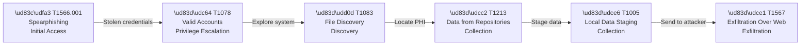
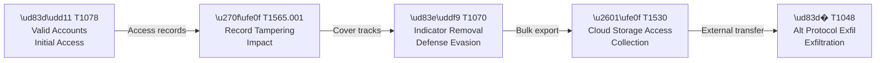
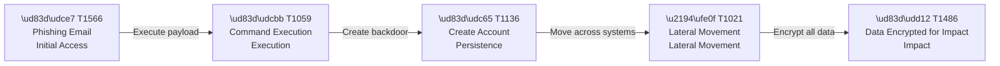
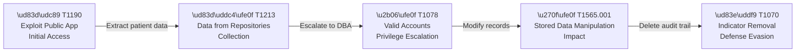
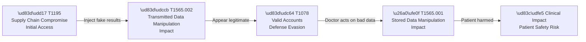

# MITRE ATT&CK Mapping — Solaris Care Connect 360

---

## What is MITRE ATT&CK?

MITRE ATT&CK (Adversarial Tactics, Techniques & Common Knowledge) is a
**globally recognised framework** maintained by the non-profit MITRE Corporation.
It is built from real-world observations of how attackers actually behave —
not theory.

Think of it as a **dictionary of attacker behaviour**, organised into three levels:

| Level | What it means | Example |
|-------|--------------|---------|
| **Tactic** | The *goal* the attacker wants to achieve | "Initial Access" — get into the system |
| **Technique** | The *method* used to achieve that goal | T1566 — Phishing email |
| **Procedure** | The *specific implementation* by a real threat actor | APT29 sends spearphishing PDFs to healthcare staff |

Every technique has a unique ID (e.g. **T1566**) and a sub-technique
notation (e.g. **T1566.001** = Spearphishing Attachment specifically).

### The 14 Tactics (in order of a typical attack)

```
Reconnaissance → Resource Development → Initial Access → Execution
→ Persistence → Privilege Escalation → Defense Evasion → Credential Access
→ Discovery → Lateral Movement → Collection → Command & Control
→ Exfiltration → Impact
```

### Why it matters for Solaris

By mapping our STRIDE threats to ATT&CK techniques we:
1. Prove our threats are grounded in **real-world attacker behaviour** (not guesswork)
2. Know **exactly which detection rules** to write in our SIEM
3. Speak the same language as every SOC, CISO and pen tester in the industry

> 💡 ATT&CK is used by: NIST, CISA, NHS Digital, Fortune 500 security teams,
> and government cybersecurity agencies worldwide.

---

## Healthcare-Specific ATT&CK Techniques

Healthcare is the #1 most targeted sector for cyberattacks because PHI is
worth 10x more than credit card data on the dark web.

| Tactic | Technique ID | Technique Name | Healthcare Risk |
|--------|-------------|----------------|-----------------|
| Initial Access | T1566 | Phishing | Staff tricked into giving credentials |
| Initial Access | T1190 | Exploit Public-Facing App | SQL injection on patient portal |
| Initial Access | T1078 | Valid Accounts | Stolen doctor login used to access PHI |
| Execution | T1059 | Command & Scripting | Malicious script run on hospital server |
| Persistence | T1136 | Create Account | Rogue admin account created |
| Persistence | T1098 | Account Manipulation | Doctor permissions silently elevated |
| Exfiltration | T1567 | Exfiltration Over Web Service | Patient data sent to attacker via HTTPS |
| Exfiltration | T1048 | Exfiltration Over Alt Protocol | Data leaked via DNS tunnelling |

---

## Full Threat-to-Technique Mapping

| STRIDE ID | Threat | ATT&CK ID | Technique | Tactic | Severity | Detection | Mitigation |
|-----------|--------|-----------|-----------|--------|----------|-----------|------------|
| S1 | Credential Theft | T1566.001 | Spearphishing Attachment | Initial Access | 🟠 High | Login anomaly detection, email security alerts | MFA, security awareness training, email filtering |
| S2 | Fake Doctor Accounts | T1136.001 | Local Account Creation | Persistence | 🔴 Critical | New account alerts, SIEM rules | Admin approval workflow, MFA, account monitoring |
| S3 | Token Forgery | T1528 | Steal Application Access Token | Credential Access | 🟠 High | Token reuse detection | Short JWT expiry, token rotation, signature validation |
| S4 | MITM on Insurance API | T1557 | Adversary-in-the-Middle | Credential Access | 🟡 Medium | TLS certificate anomaly alerts | Mutual TLS (mTLS), certificate pinning |
| S5 | Lab Result Spoofing | T1195 | Supply Chain Compromise | Initial Access | 🔴 Critical | Anomalous result patterns, source verification | mTLS with lab systems, result signing |
| T1 | Record Modification | T1565.001 | Stored Data Manipulation | Impact | 🔴 Critical | File integrity monitoring, DB change alerts | Field-level hashing, RBAC write controls |
| T2 | Prescription Alteration | T1565.001 | Stored Data Manipulation | Impact | 🔴 Critical | Rx change audit alerts | Digital Rx signatures, immutable Rx log |
| T3 | Audit Log Tampering | T1070 | Indicator Removal | Defense Evasion | 🟠 High | Log gap detection, SIEM alerting | Write-once audit store, off-system backup |
| T4 | Claims Manipulation | T1565 | Data Manipulation | Impact | 🟠 High | Payload checksum validation, reconciliation alerts | Payload signing, encrypted DB fields, reconciliation checks |
| T5 | Vitals Tampering | T1565.002 | Transmitted Data Manipulation | Impact | 🔴 Critical | Threshold anomaly detection | Sensor data signing, redundant monitoring |
| R1 | Prescription Denial | T1070 | Indicator Removal | Defense Evasion | 🟠 High | Signed approval audit trail | Cryptographically signed Rx approvals |
| R2 | Access Denial | T1070.001 | Clear Windows Event Logs | Defense Evasion | 🟡 Medium | Immutable log access monitoring | Immutable access logs with user ID, IP, and timestamp |
| R3 | Permission Change Denial | T1078 | Valid Accounts | Defense Evasion | 🟠 High | Admin action audit alerts, privilege change monitoring | Admin action logging, dual-approval for privilege changes |
| R4 | Claim Receipt Denial | T1557 | Adversary-in-the-Middle | Credential Access | 🟡 Medium | Delivery acknowledgement monitoring | Signed receipts, message delivery acknowledgements |
| R5 | Export Audit Gap | T1530 | Data from Cloud Storage | Collection | 🟠 High | Export event monitoring, DLP alerts | Mandatory export logging, DLP controls |
| I1 | SQL Injection | T1190 | Exploit Public-Facing App | Initial Access | 🔴 Critical | WAF alerts, DB query anomaly detection | Parameterised queries, WAF, input validation |
| I2 | Excessive Data Return | T1213 | Data from Info Repositories | Collection | 🟠 High | API response size monitoring | Response filtering, API field allowlists |
| I3 | Verbose Error Messages | T1082 | System Information Discovery | Discovery | 🟡 Medium | Error response content monitoring | Generic error responses in production, detailed logs server-side only |
| I4 | Unencrypted Transit | T1040 | Network Sniffing | Credential Access | 🔴 Critical | TLS enforcement monitoring | TLS 1.2+ enforced, HSTS headers |
| I5 | Exposed Backups | T1530 | Data from Cloud Storage | Collection | 🔴 Critical | S3 public access alerts | Encrypted backups, private S3 buckets |
| I6 | PHI in Logs | T1552 | Unsecured Credentials | Credential Access | 🟠 High | Log content scanning, PII detection alerts | Log scrubbing rules, PII-aware logging libraries |
| D1 | DDoS Attack | T1498 | Network Denial of Service | Impact | 🟠 High | Traffic volume anomaly detection | WAF, rate limiting, CDN-based mitigation |
| D2 | Database Exhaustion | T1499 | Endpoint Denial of Service | Impact | 🟠 High | DB connection pool monitoring, slow query alerts | Query timeouts, connection pooling limits, read replicas |
| D3 | Storage Exhaustion | T1499.001 | OS Exhaustion Flood | Impact | 🟡 Medium | Disk usage monitoring, upload rate alerts | File size limits, upload quotas per user |
| D4 | Mass Account Lockout | T1110 | Brute Force | Credential Access | 🟡 Medium | Failed login rate alerts | Progressive delays, CAPTCHA, SOC alerting |
| D5 | Rx Service Overload | T1499 | Endpoint Denial of Service | Impact | 🟠 High | Request queue depth monitoring, error rate alerts | Input validation, request rate limiting, queue depth monitoring |
| E1 | Patient → Doctor Privilege | T1078 | Valid Accounts | Privilege Escalation | 🔴 Critical | Role anomaly detection, privilege change alerts | Strict RBAC, server-side authorisation on every API |
| E2 | Doctor → Admin Privilege | T1078.003 | Cloud Accounts | Privilege Escalation | 🔴 Critical | Admin role assignment alerts, MFA bypass detection | Separate admin accounts, MFA for admin actions, least privilege |
| E3 | SQLi → DBA Access | T1190 | Exploit Public-Facing App | Privilege Escalation | 🔴 Critical | DB privilege escalation alerts | Parameterised queries, DB least privilege |
| E4 | Container Escape | T1611 | Escape to Host | Privilege Escalation | 🔴 Critical | Runtime anomaly detection (Falco) | Read-only containers, no privileged mode |
| E5 | IDOR | T1548 | Abuse Elevation Control | Privilege Escalation | 🟠 High | Abnormal record access patterns | Server-side authorisation, never trust client IDs |

---

## Attack Chains

> Five realistic attack scenarios modelled against Solaris Care Connect 360.
> Each chain shows how techniques link together and what stops them.

---

### Chain 1: PHI Data Breach via Phishing
> The most common healthcare attack. Attacker steals credentials and exfiltrates patient data.



**What stops this chain at Solaris:**
- `A → B` MFA blocks stolen credentials from being used
- `B → C` RBAC limits what a compromised account can discover
- `C → D` API returns only permitted fields (field allowlists)
- `D → E` DLP alerts on bulk data access (>1000 records)
- `E → F` Outbound firewall blocks data leaving to unknown destinations

---

### Chain 2: Insider Threat — Rogue Doctor
> Malicious insider with valid credentials steals and manipulates patient records.



**What stops this chain at Solaris:**
- `A → B` Every field change is hashed and audit-logged (tampering detected immediately)
- `B → C` Audit logs are immutable and write-once (cannot be deleted by anyone)
- `C → D` Bulk exports require approval and trigger DLP alerts
- `D → E` DNS anomaly detection catches exfiltration via alternative protocols

---

### Chain 3: Ransomware Attack
> Attacker enters via phishing, establishes persistence, moves laterally, encrypts everything.



**What stops this chain at Solaris:**
- `A → B` Email sandboxing and macro blocking prevents payload execution
- `B → C` Admin account creation requires dual approval and MFA
- `C → D` Network segmentation isolates DB in private VPC (no lateral path)
- `D → E` Immutable encrypted backups allow full recovery without paying ransom

---

### Chain 4: SQL Injection to Full Database Compromise
> Attacker exploits unsanitised input in the patient portal to steal and manipulate data.



**What stops this chain at Solaris:**
- `A → B` Parameterised queries and WAF block SQL injection at entry point
- `B → C` Application DB user has SELECT-only permissions — no DBA escalation path
- `C → D` Field-level integrity hashing detects any record modification
- `D → E` Audit logs stored in write-once isolated database — deletion is impossible

---

### Chain 5: Supply Chain Attack via Compromised Lab Feed
> Attacker compromises a third-party lab system and injects fake results into Solaris.



**What stops this chain at Solaris:**
- `A → B` mTLS with all lab systems — only verified, pinned certificates accepted
- `B → C` Cryptographic signing on all lab results — unsigned results are rejected
- `C → D` Anomaly detection flags results outside statistically normal ranges
- `D → E` Pharmacist confirmation step required before acting on critical lab results

---

## Recommended Mitigations by Tactic

### Initial Access
- **M1017: User Training** — Phishing awareness, mandatory simulations
- **M1031: Network Intrusion Prevention** — WAF rules, IDS/IPS
- **M1050: Exploit Protection** — Input validation, parameterised queries
- **M1021: Restrict Web Content** — Block known malicious domains

### Persistence
- **M1032: Multi-factor Authentication** — All accounts, especially admin
- **M1026: Privileged Account Management** — Separate admin accounts
- **M1018: User Account Management** — Admin approval workflow for new accounts

### Credential Access
- **M1027: Password Policies** — Minimum length, bcrypt hashing, no plain text
- **M1032: MFA** — TOTP for all users
- **M1054: Software Configuration** — Token short expiry, signature validation

### Privilege Escalation
- **M1026: Privileged Account Management** — Never use admin for daily work
- **M1036: Accounts Role Security** — RBAC enforced server-side on every API call
- **M1051: Update Software** — Patch privilege escalation CVEs immediately

### Defense Evasion
- **M1022: Restrict File Permissions** — Audit logs write-once, no delete permitted
- **M1047: Audit** — SIEM alerting on any log gap or deletion attempt

### Collection
- **M1057: Data Loss Prevention** — Alert on bulk exports >1000 records
- **M1041: Encrypt Sensitive Information** — PHI encrypted at rest (AES-256)

### Exfiltration
- **M1057: Data Loss Prevention** — DLP monitoring on all outbound data
- **M1037: Filter Network Traffic** — Whitelist outbound destinations only
- **M1041: Encrypt Sensitive Information** — TLS 1.2+ on all connections

### Impact
- **M1053: Data Backup** — Daily encrypted backups, immutable S3 storage
- **M1030: Network Segmentation** — DB in private VPC, no direct public access
- **M1026: Privileged Account Management** — Limit who can run destructive operations

---

## Tactic Coverage Summary

| Tactic | Threats Mapped | Coverage |
|--------|---------------|---------|
| Initial Access | S1, S5, I1 | ✅ Covered |
| Execution | Chain 3 | ✅ Covered |
| Persistence | S2, R1 | ✅ Covered |
| Privilege Escalation | E1, E2, E3, E4, E5 | ✅ Covered |
| Defense Evasion | T3, R1, R2, R3 | ✅ Covered |
| Credential Access | S3, S4, I4, I6, D4, R4 | ✅ Covered |
| Discovery | I3, Chain 1 | ✅ Covered |
| Collection | R5, I2, I5 | ✅ Covered |
| Exfiltration | Chains 1 + 2 | ✅ Covered |
| Impact | T1, T2, T4, T5, D1, D2, D3, D5 | ✅ Covered |
| Lateral Movement | Not yet mapped | ⚠️ Gap |
| Command & Control | Not yet mapped | ⚠️ Gap |

**Coverage Score: 10 / 12 tactics = 83%**

> ⚠️ Lateral Movement and Command & Control are identified gaps for the
> next iteration of this threat model. Low risk currently due to
> network segmentation and strict outbound firewall rules.

---

## Key Resources

| Resource | URL | Purpose |
|----------|-----|---------|
| MITRE ATT&CK Framework | https://attack.mitre.org | Browse all tactics & techniques |
| MITRE for Healthcare (HHS) | https://www.hhs.gov/sites/default/files/hph-threat-profiling-mitre-attck.pdf | Healthcare-specific guidance |
| HHS HIPAA Security Rule | https://www.hhs.gov/hipaa/for-professionals/security/ | Compliance requirements |
| NIST Cybersecurity Framework | https://www.nist.gov/cyberframework | Security controls standard |
| OWASP Top 10 | https://owasp.org/www-project-top-ten/ | Web vulnerability reference |
