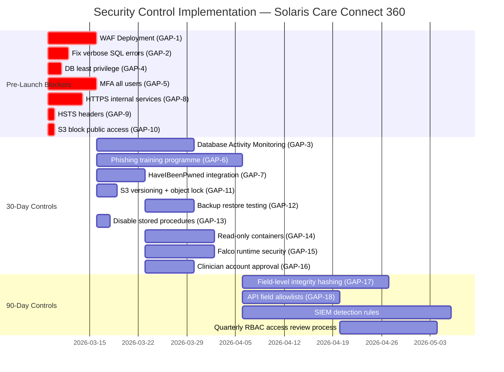
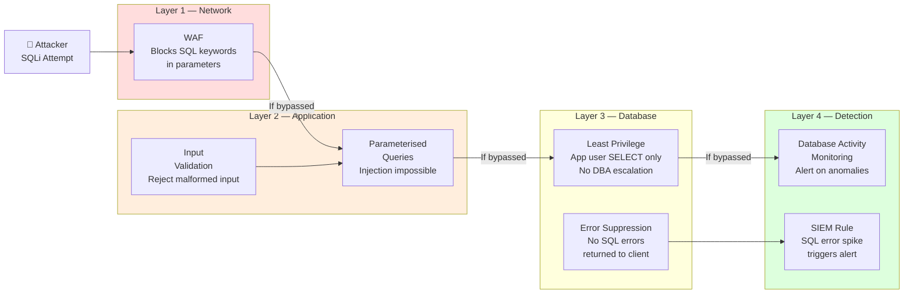

# Security Control Mapping — Solaris Care Connect 360

---

## What is Security Control Mapping?

A security control is any technical, procedural, or administrative measure
that **prevents, detects, or corrects** a security threat. Control mapping
is the process of linking every identified risk to the specific controls
that address it.

This document does three things:
1. Maps every STRIDE threat to its controls (what we have)
2. Identifies gaps (what is missing or incomplete)
3. Provides a prioritised implementation roadmap (what to build next)

---

## Control Categories

Every security control belongs to one of three categories:

| Category | Purpose | Examples |
|----------|---------|---------|
| **Preventive** | Stop an attack before it happens | Firewalls, encryption, MFA, input validation |
| **Detective** | Identify an attack in progress or after the fact | Logging, SIEM, anomaly detection, audits |
| **Corrective** | Respond to and recover from an attack | Incident response, backups, patch management |

> A mature security posture requires all three. Preventive controls alone
> are insufficient — you must also be able to detect attacks that bypass
> prevention, and recover from those that succeed.

---

## NIST Cybersecurity Framework (CSF)

Every control in this document maps to the **NIST Cybersecurity Framework**
— the globally adopted standard for organising security controls. NIST CSF
is used by NHS Digital, the US Department of Health, and most enterprise
security teams worldwide.

NIST CSF organises controls into five functions:

| Function | Code | Purpose | Example Controls |
|----------|------|---------|-----------------|
| **Identify** | ID | Understand your assets and risks | Asset inventory, risk assessments |
| **Protect** | PR | Prevent unauthorised access and harm | MFA, encryption, access controls |
| **Detect** | DE | Identify attacks when they occur | SIEM, anomaly detection, monitoring |
| **Respond** | RS | Act on detected incidents | Incident response plan, communications |
| **Recover** | RC | Restore systems after an incident | Backups, disaster recovery |

Each NIST control has a unique reference code (e.g. **PR.AC-4** = Protect,
Access Control, sub-control 4). These are used throughout this document.

---

## Control Status Definitions

| Status | Meaning |
|--------|---------|
| ✅ Implemented | Control is in place and operating effectively |
| 🟡 Partial | Control exists but has gaps or is not fully enforced |
| ❌ Missing | No control in place — gap exists |

> ⚠️ A **Missing** control against a **Critical** risk is an urgent finding
> that must be remediated before the system goes live.

---

## Full Control Mapping Matrix

> Every top-priority STRIDE threat mapped to its required controls,
> type, NIST reference, and current implementation status.

### I1 — SQL Injection (Risk Score: 20 / Critical)

| Control | Type | NIST CSF | Status | Notes |
|---------|------|----------|--------|-------|
| Parameterised queries / prepared statements | Preventive | PR.DS-2 | 🟡 Partial | ORM in use but some raw queries remain |
| Web Application Firewall (WAF) | Preventive | PR.PT-4 | ❌ Missing | Not yet deployed — GAP-1 |
| Input validation on all API parameters | Preventive | PR.DS-2 | 🟡 Partial | Inconsistent across endpoints |
| Verbose error suppression in production | Preventive | PR.DS-2 | ❌ Missing | SQL errors still returned to client — GAP-2 |
| Database Activity Monitoring (DAM) | Detective | DE.CM-3 | ❌ Missing | No real-time query monitoring — GAP-3 |
| SIEM alerting on SQL error spike | Detective | DE.AE-2 | ❌ Missing | No rule configured |
| DB user account — SELECT privilege only | Preventive | PR.AC-4 | ❌ Missing | App currently runs with DBA-level access — GAP-4 |

---

### S1 — Credential Theft via Phishing (Risk Score: 16 / Critical)

| Control | Type | NIST CSF | Status | Notes |
|---------|------|----------|--------|-------|
| Multi-factor Authentication (MFA) | Preventive | PR.AC-7 | 🟡 Partial | Implemented for admin only — not all users — GAP-5 |
| Security awareness and phishing simulation | Preventive | PR.AT-1 | ❌ Missing | No training programme in place — GAP-6 |
| Email security gateway (SPF/DKIM/DMARC) | Preventive | PR.PT-4 | ✅ Implemented | DMARC set to quarantine |
| Email sandboxing and attachment detonation | Preventive | PR.PT-4 | ✅ Implemented | Malicious attachments opened in isolated environment |
| Credential breach monitoring (HaveIBeenPwned) | Detective | DE.CM-1 | ❌ Missing | Not yet integrated — GAP-7 |
| Login anomaly detection (unusual IP/time) | Detective | DE.AE-1 | 🟡 Partial | Basic geo-blocking in place — no behavioural baseline |
| Forced password reset on breach detection | Corrective | RS.MI-3 | ❌ Missing | No automated response trigger |

---

### I4 — Unencrypted Data in Transit (Risk Score: 15 / High)

| Control | Type | NIST CSF | Status | Notes |
|---------|------|----------|--------|-------|
| TLS 1.2+ enforced on all endpoints | Preventive | PR.DS-2 | 🟡 Partial | Some internal service-to-service calls use HTTP — GAP-8 |
| HSTS headers on all web-facing services | Preventive | PR.DS-2 | ❌ Missing | Not configured — GAP-9 |
| mTLS between internal microservices | Preventive | PR.DS-2 | ❌ Missing | Planned — not yet deployed |
| TLS certificate monitoring and alerting | Detective | DE.CM-1 | ❌ Missing | No alerting on expiry or anomaly |
| Certificate pinning on third-party APIs | Preventive | PR.PT-4 | 🟡 Partial | Implemented for insurance API only |

---

### I5 — Exposed Backup Files (Risk Score: 15 / High)

| Control | Type | NIST CSF | Status | Notes |
|---------|------|----------|--------|-------|
| S3 Block Public Access enforced | Preventive | PR.DS-1 | ❌ Missing | Backup bucket ACL not audited — GAP-10 |
| AES-256 encryption at rest (AWS KMS) | Preventive | PR.DS-1 | 🟡 Partial | RDS encrypted; S3 backup bucket not confirmed |
| S3 bucket versioning and object lock | Preventive | PR.DS-1 | ❌ Missing | Not configured — GAP-11 |
| Backup access alerting | Detective | DE.CM-3 | ❌ Missing | No alert on unexpected backup access |
| Regular backup restore testing | Corrective | RC.RP-1 | ❌ Missing | Recovery never tested — GAP-12 |

---

### E3 — SQLi to DBA Access (Risk Score: 15 / High)

| Control | Type | NIST CSF | Status | Notes |
|---------|------|----------|--------|-------|
| Database least privilege (SELECT-only app user) | Preventive | PR.AC-4 | ❌ Missing | App DB user has DBA-level access — GAP-4 |
| Disable xp_cmdshell and dangerous stored procs | Preventive | PR.PT-3 | ❌ Missing | Not reviewed — GAP-13 |
| Privileged access monitoring on DB | Detective | DE.CM-3 | ❌ Missing | No alerting on privilege escalation in DB |
| DB admin access via bastion host only | Preventive | PR.AC-3 | ❌ Missing | DBA access not restricted to bastion |

---

### E4 — Container Escape (Risk Score: 15 / High)

| Control | Type | NIST CSF | Status | Notes |
|---------|------|----------|--------|-------|
| Read-only container filesystems | Preventive | PR.PT-3 | ❌ Missing | Containers currently run with write access — GAP-14 |
| No privileged container mode | Preventive | PR.PT-3 | 🟡 Partial | Some containers still use privileged flag |
| Container runtime security (Falco) | Detective | DE.CM-3 | ❌ Missing | Not deployed — GAP-15 |
| Container image vulnerability scanning (Trivy) | Detective | DE.CM-8 | ❌ Missing | No CI/CD image scanning |
| Network policy — container-to-host blocked | Preventive | PR.AC-5 | 🟡 Partial | VPC rules exist; pod-level network policy absent |

---

### S2 — Fake Doctor Accounts (Risk Score: 15 / High)

| Control | Type | NIST CSF | Status | Notes |
|---------|------|----------|--------|-------|
| Admin approval workflow for new accounts | Preventive | PR.AC-1 | ❌ Missing | Accounts auto-provisioned — GAP-16 |
| Identity verification for clinician onboarding | Preventive | PR.AC-1 | ❌ Missing | No GMC number / credentials check |
| New account creation alerting | Detective | DE.CM-3 | 🟡 Partial | Logged but no alert triggered |
| MFA enforced on all clinical accounts | Preventive | PR.AC-7 | 🟡 Partial | Admin-only currently |
| Regular access reviews (quarterly) | Corrective | PR.AC-1 | ❌ Missing | No review process in place |

---

### E1 — Privilege Escalation (Risk Score: 12 / High)

| Control | Type | NIST CSF | Status | Notes |
|---------|------|----------|--------|-------|
| RBAC with defined role hierarchy | Preventive | PR.AC-4 | 🟡 Partial | Roles defined but not enforced server-side consistently |
| Server-side authorisation on every API endpoint | Preventive | PR.AC-4 | 🟡 Partial | Some endpoints rely on client-supplied role |
| Privilege change alerting | Detective | DE.AE-1 | ❌ Missing | No SIEM rule for role changes |
| Separation of duty — admin requires 2FA | Preventive | PR.AC-7 | 🟡 Partial | MFA on admin login but not on privilege changes |
| Quarterly RBAC audit | Corrective | PR.AC-1 | ❌ Missing | No review cadence established |

---

### T1 — Patient Record Modification (Risk Score: 12 / High)

| Control | Type | NIST CSF | Status | Notes |
|---------|------|----------|--------|-------|
| Field-level integrity hashing (SHA-256) | Preventive | PR.DS-6 | ❌ Missing | No hash verification on record reads — GAP-17 |
| Immutable audit log on all record writes | Detective | DE.CM-3 | 🟡 Partial | Logging exists but audit DB is not write-once |
| Write access restricted to treating clinician only | Preventive | PR.AC-4 | 🟡 Partial | RBAC partially enforced |
| Alert on unexpected record modification | Detective | DE.AE-2 | ❌ Missing | No SIEM rule for off-hours writes |

---

### I2 — Excessive Data Return (Risk Score: 12 / High)

| Control | Type | NIST CSF | Status | Notes |
|---------|------|----------|--------|-------|
| API field allowlists (return only required fields) | Preventive | PR.DS-2 | ❌ Missing | APIs return full object by default — GAP-18 |
| Pagination limits on bulk queries | Preventive | PR.DS-2 | 🟡 Partial | Some endpoints have no page size limit |
| API response size monitoring | Detective | DE.CM-1 | ❌ Missing | No alerting on unusually large responses |
| DLP alert on bulk data access | Detective | DE.DP-5 | ❌ Missing | No threshold configured |

---

## Gap Analysis — Complete Register

> All control gaps identified, consolidated and prioritised.

| Gap ID | Risk ID | Control Missing | Severity | Effort | Priority |
|--------|---------|----------------|----------|--------|----------|
| GAP-1 | I1 | Web Application Firewall not deployed | 🔴 Critical | Medium | Pre-launch |
| GAP-2 | I1 | SQL error messages returned to client | 🔴 Critical | Low | Pre-launch |
| GAP-3 | I1 | No database activity monitoring | 🔴 Critical | High | 30 days |
| GAP-4 | I1, E3 | App DB user has DBA-level access | 🔴 Critical | Low | Pre-launch |
| GAP-5 | S1 | MFA not enforced for all users | 🔴 Critical | Medium | Pre-launch |
| GAP-6 | S1 | No phishing awareness training programme | 🟠 High | Low | 30 days |
| GAP-7 | S1 | No breach credential monitoring | 🟠 High | Low | 30 days |
| GAP-8 | I4 | Internal service calls use HTTP not HTTPS | 🟠 High | Medium | Pre-launch |
| GAP-9 | I4 | HSTS headers not configured | 🟠 High | Low | Pre-launch |
| GAP-10 | I5 | S3 backup bucket public access not blocked | 🔴 Critical | Low | Pre-launch |
| GAP-11 | I5 | S3 versioning and object lock not enabled | 🟠 High | Low | Pre-launch |
| GAP-12 | I5 | Backup restore never tested | 🟠 High | Medium | 30 days |
| GAP-13 | E3 | Dangerous stored procedures not disabled | 🟠 High | Low | 30 days |
| GAP-14 | E4 | Containers not running read-only | 🟠 High | Medium | 30 days |
| GAP-15 | E4 | No container runtime security (Falco) | 🟠 High | Medium | 30 days |
| GAP-16 | S2 | No admin approval for new clinician accounts | 🟠 High | Medium | 30 days |
| GAP-17 | T1 | No field-level integrity hashing on records | 🟠 High | High | 30 days |
| GAP-18 | I2 | APIs return full object — no field allowlists | 🟠 High | Medium | 30 days |

**Total gaps identified: 18**
**Pre-launch blockers: 8 (GAP-1, 2, 4, 5, 8, 9, 10)**
**30-day remediations: 10**

---

## NIST CSF Coverage Summary

| NIST Function | Controls Mapped | Implemented | Partial | Missing |
|---------------|:--------------:|:-----------:|:-------:|:-------:|
| **Identify** (ID) | 3 | 1 | 1 | 1 |
| **Protect** (PR) | 28 | 4 | 11 | 13 |
| **Detect** (DE) | 16 | 2 | 3 | 11 |
| **Respond** (RS) | 3 | 0 | 1 | 2 |
| **Recover** (RC) | 3 | 0 | 1 | 2 |
| **Total** | **53** | **7 (13%)** | **17 (32%)** | **29 (55%)** |

> The Detect, Respond, and Recover functions are significantly under-implemented.
> A system that prevents attacks but cannot detect or recover from them is
> not production-ready for a healthcare environment.

---

## Control Implementation Roadmap

---

## Defense-in-Depth Visualisation

The diagram below shows how multiple control layers protect against the
highest-priority threat (SQL injection). Each layer is independent — if
one fails, the next holds.

---

## Glossary

| Term | Definition |
|------|-----------|
| **Preventive control** | A measure that stops an attack before it succeeds |
| **Detective control** | A measure that identifies an attack in progress or after the fact |
| **Corrective control** | A measure that restores normal operation after an attack |
| **NIST CSF** | National Institute of Standards and Technology Cybersecurity Framework — the global standard for organising security controls |
| **Defense-in-depth** | Layering multiple independent controls so that bypassing one does not compromise the whole system |
| **Control gap** | A risk that has no effective control in place |
| **Pre-launch blocker** | A gap so severe that the system must not accept live patient data until it is resolved |
| **DAM** | Database Activity Monitoring — real-time detection of suspicious database queries |
| **WAF** | Web Application Firewall — filters malicious HTTP requests before they reach the application |
